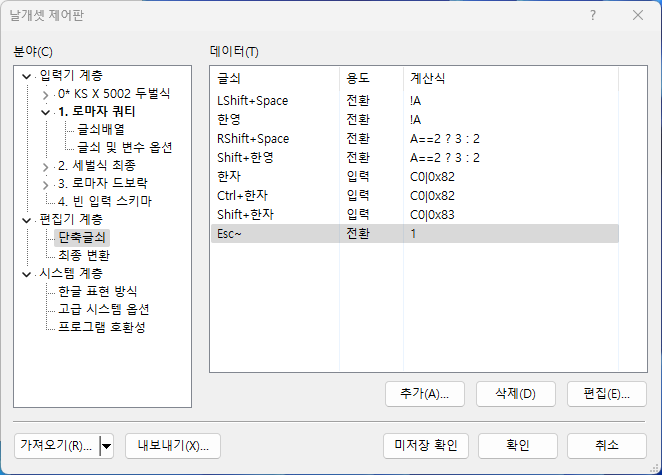

# Personal Neovim Configuration

## Background
처음에는 Neovim을 단순히 Vim의 대체품 정도로 생각했고 Windows 환경에서는 기본 GUI client가 부실해서 사용하지 않았다.
시간이 좀 지난 지금은 Neovim에 많은 기능이 추가되었고 또 매우 많은 plugin들이 개발되었다.
Neovim의 plugin은 처음에는 Vim script로 만들어진 기존 plugin을 많이 사용했으나 Lua 지원이 정착되면서 현재는 Lua로 작성된 멋진 plugin들이 많아졌다.

너무 많은 plugin들이 있기 때문에 고르기가 쉽지 않았다.
[awesome-neovim](https://github.com/rockerBOO/awesome-neovim)에 어느정도 추려진 목록이 있지만 그래도 많다.
그래서 [LazyVim](https://github.com/LazyVim/LazyVim)에서 사용하는 plugin들과 설정을 참고해서 개인 설정을 만들기로 했다.

Windows에서 GUI client를 사용하는 환경을 기준으로 한다.  
Neovim의 기본 GUI인 neovim-qt가 일부 글꼴 문제가 있어 [Neovide](https://github.com/neovide/neovide)를 사용하기로 한다.  
=> Neovide의 버그 때문에 다른 대체제를 찾아보았고 결국은 Neovim Qt의 설정 문제를 찾아 수정하고 사용하기로 했다.(https://github.com/folke/lazy.nvim/issues/584)

[발견한 Neovim GUI client 문제들]
* 공통: 한글입력이 매끄럽지 않다. 한글 입력창 문제.
* neoary: 전체적으로 글자가 흐리게 보인다.
* fvim: totalcmd, eclipse 등 윈도우 탐색기 외의 프로그램에서 파일을 drag and drop으로 열 수 없다.
* Neovide: 시작할 때 창 크기가 닫았을 때 보다 커진다. https://github.com/neovide/neovide/issues/1400

## Configuration Layout
LazyVim과 같이 많은 plugin과 custom설정을 관리하는 경우 여러 파일과 폴더로 config 파일을 구분하고 있다.
하지만 나는 그 정도로 복잡하게 관리하고 싶지 않기 때문에 [nvim-starter](https://github.com/VonHeikemen/nvim-starter)의 [02-opinionated](https://github.com/VonHeikemen/nvim-starter/tree/02-opinionated)와 같이 init.lua 파일 하나에서 모든 설정을 관리하려고 한다.

## Plugins
### Plugin Manager
기존에는 [vim-plug](https://github.com/junegunn/vim-plug)를 사용했지만 되도록Lua로 작성된 plugin들로
모두 바꿀 생각이므로 plugin manager도 Lua로 만들어진 것을 사용하기로 한다.
[savq/paq-nvim](https://github.com/savq/paq-nvim)이 별이 더 많지만 참고 대상인 LazyVim에서 lazy.nvim을 사용하고 있기 때문에 [folke/lazy.nvim](https://github.com/folke/lazy.nvim)으로 선택했다.

### Colorscheme
[folke/tokyonight.nvim](https://github.com/folke/tokyonight.nvim)이 LazyVim의 기본 테마로 현재 awesome-nvim에서 가장 인기있는 colorscheme이다.
개인적으로 light 테마는 [EdenEast/nightfox.nvim](https://github.com/EdenEast/nightfox.nvim)의 dayfox가 더 마음에 들어 tokyonight 와 함께 설치해서 바꿔가며 써보고 있다.

### Statusline
LazyVim에서 사용하고 있고 하단의 Statusline을 꾸미는 plugin 중 awesome-neovim에서 가장 인기 있는 [nvim-lualine/lualine.nvim](https://github.com/nvim-lualine/lualine.nvim)을 선택했다.

### Tabline
LazyVim에서 사용하고 있고 상단의 Tabline을 위한 plugin 중 awesome-neovim에서 가장 인기 있는 [akinsho/bufferline.nvim](https://github.com/akinsho/bufferline.nvim)을 선택했다.

### File Explorer
LazyVim에서 사용하고 있는 File Explorer인 [nvim-neo-tree/neo-tree.nvim](https://github.com/nvim-neo-tree/neo-tree.nvim)를 선택했다.

### Fuzzy Finder
LazyVim에서 사용하고 있는 Fuzzy Finder인 [nvim-telescope/telescope.nvim](https://github.com/nvim-telescope/telescope.nvim)를 선택했다.

### Editing Support
LazyVim에서는 session management나 project management plugin도 사용하지만 나는 그 정도는 필요없고 파일을 다시 열었을 때 마지막 cursor position에서 다시 시작하게 해 주는 기능 정도만 필요하다.
그래서 [nvim-lastplace](https://github.com/ethanholz/nvim-lastplace)를 추가했다.

GVim을 버리고 Neovim으로 바꾸지 못했던 이유 중 하나는 한글 입력 중 ESC를 누르면 Normal 모드가 되면서 자동으로 입력 언어를 영어로 바꿔주는 기능이 있었기 때문이다.
[keaising/im-select.nvim](https://github.com/keaising/im-select.nvim) plugin이 Neovim에서도 이를 가능하게 해주기 때문에 추가로 설치했다.

**Remark:** input method를 바꾸는 방식이기 때문에 영어 입력이 따로 설치되어 있어야 한다. 한글 윈도우에서는 기본으로 '한국어'만 설치되어 있는데 윈도우즈의 "설정 > 시간 및 언어 > 언어 및 지역"에 '영어(미국)'를 추가로 설치해야 한다.

### misc
- [nvim-tree/nvim-web-devicons](https://github.com/nvim-tree/nvim-web-devicons): 아이콘 표시를 위해 설치. lualine, bufferline, neo-tree에서 사용.
- [famiu/bufdelete.nvim](https://github.com/famiu/bufdelete.nvim): 버퍼를 닫았을 때 window layout이 망가지는 것을 방지. bufferline과 연동해서 사용.
- [nvim-lua/plenary.nvim](https://github.com/nvim-lua/plenary.nvim): neo-tree, telescope에서 사용
- [MunifTanjim/nui.nvim](https://github.com/MunifTanjim/nui.nvim): neo-tree에서 사용

### Other Dependency
- [ripgrep](https://github.com/BurntSushi/ripgrep): telescope에서 빠른 검색을 위해 사용
- [fd](https://github.com/sharkdp/fd): telescope에서 빠른 검색을 위해 사용
- [daipeihust/im-select](https://github.com/daipeihust/im-select): 한/영 자동변환을 위해 사용. im-select.nvim에서 사용.
- Meslo: Nerd font
